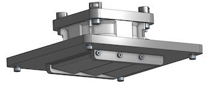

<div style="width: 50em"> 

# Printer Enclosure Temperature Controller

[](./photos/petc-controller-cutaway.png)
[](./photos/petc-heater.png)
[](./photos/petc-psu.png)
[](./photos/petc-fan.png)
[](./photos/petc-fan-hose-coupler.png)
[](./photos/petc-snorkle-transport-handle.png)
[](./photos/petc-xbuddy-board-snorkle-cover.png)

[(more photos)](https://photos.app.goo.gl/Emhybk4XVMSFG9o47) [(video)](https://youtube.com/shorts/DhWX0z7hWWk) [(schematic)](./photos/petc_schematic.jpg)

This is an enclosure temperature controller for 3D printers.  I was inspired by [Lars' Automated Heating System for Original Enclosure](https://www.printables.com/model/561491-automated-heating-system-for-original-enclosure), but I wanted a different [feature set](#features).  The code and documentation of this project are under the [MIT License](./LICENSE.txt).  The mechanical CAD is an [OnShape](https://www.onshape.com) [public document](https://cad.onshape.com/documents/f44140cba6f8b67dad0ae1df/w/266792716668dc913b5493d9/e/d40b23f5562de2835c96fe1f) which has MIT-like [license terms](https://www.onshape.com/en/legal/terms-of-use).

There are pros and cons to experimenting with adding active heating or cooling to the enclosure of a 3D printer that was not specifically designed for it.  Of course, there can be dangers including fire hazards and the possibility of melting parts of your printer.  **If you use the information provided here, you do so at your own risk.**  I am only experimenting with this myself, and I make no claims as to the suitability or safety of any of this information.  Until fairly recently, Stratasys held key patents regarding 3D printers with heated build chambers.  It is my understanding that these patents have now effectively [expired](https://3dprintingindustry.com/news/stratasys-heated-build-chamber-for-3d-printer-patent-us6722872b1-set-to-expire-this-week-185012).

I'm using a Prusa MK4S with an [Original Prusa Enclosure](https://www.prusa3d.com/product/original-prusa-enclosure), though where possible I've tried to make the design agnostic to the specifics of the printer and enclosure.  There are some mounting features that make it fit this Prusa setup nicely, but it should be adaptable to other configurations without too much difficulty.

## Heating and Cooling
Some materials, including PLA, prefer relatively cool air temperatures.  While PLA is generally considered easy to print on non-enclosed printers, if your printer is in an enclosure, PLA prints may have issues due to ambient heating from the printer bed.  In my experience even leaving the enclosure doors open may not always be sufficient.  This controller allows you to add a fan to your enclosure to actively exhaust the hot air and draw in more cool air from the room.

Other materials, including ABS, ASA, Nylon (PA), and polycarbonate (PC), perfer relatively hot air temperatures to reduce warping and improve layer adhesion during printing.  And these "engineering" materials can be desirable for some applications for their mechanical properties and temerature resistance.  This controller allows you to add an active heating element in the enclosure with closed loop control to increase the enclosure temperature more quickly and to maintain hotter temperatures than would typically be reached by the bed heater alone.

How hot is hot?  From what I've read, many of these materials would be happy with air temperatures in the range of 90C, and industrial printers with heated enclosures may use that type of temperature.  Unfortunately, many of the plastic and electronic parts in consumer 3D printers might become unstable at at that level.  However, by [some accounts](https://forum.prusa3d.com/forum/user-and-hardware-mods/heating-the-prusa-enclosure), even 40-45C can help significantly reduce warping in ABS and ASA prints.

This controller initially had a hardcoded limit of 45C, which is the same as [Lars'](https://www.printables.com/model/561491-automated-heating-system-for-original-enclosure).  Temperatures higher than that tend to trigger automatic shutdown of the xBuddy control board on the Prusa MK4(S).  Also, most of the MK4 and MK4S printed parts from Prusa are made with PETG, which has relatively poor high temperature stability.  I eventally replaced all the PETG parts with PC-CF, which has better temperature stability, and added a "snorkle" setup which cools the buddy board with outside air, re-using the exhaust fan to pull the air through the snorkle.  This appears to allow enclosure temperatures up to about 60-65C.

There are a wide variety of printers now available, and some may be more suitable for higher temperatures than others.  Some [QiDi](https://qidi3d.com) printers go up to 60C or 65C.  The [Prusa Core One](https://www.prusa3d.com/product/prusa-core-one) can reach a maximum temperature of 55C, but is only heated "passively" by the print bed.  Apparently Prusa [recommends a maximum enclosure temperature of 40C](https://forum.prusa3d.com/forum/postid/630914) for MK3S+, though this may at least be in part due to the PETG parts.  This also probably applies to MK4, though Prusa is now switching some of the PETG parts to PC-CF on the MK4S.


The 300W heating element seems can take up to about an hour to initially preheat the chamber up to ~60C from room temperature, even when also using the [heat bed set to 120C](./prusa-mk4-bed-preheat-120c-90m.gcode) to supplement the preheating.  I have [sealed](https://www.printables.com/model/537013-0073-xrivets-for-original-prusa-enclosure-ope-extr) most of the holes in the Original Prusa Enclosure.  I also added reflective bubble foil [insulation](https://www.homedepot.com/p/Everbilt-24-in-x-10-ft-Double-Reflective-Insulation-Radiant-Barrier-24x10DRI/314983628) (rated to about 70C) inside the left, right, and rear walls, and a blanket of fiberglass insulation (stable up to about 500C) above the top of the enclosure.

## Features
* printable parts designed in [OnShape](https://cad.onshape.com/documents/f44140cba6f8b67dad0ae1df/w/266792716668dc913b5493d9/e/d40b23f5562de2835c96fe1f)
* no custom PCBs, perfboards, or breadboards, only an off-the-shelf SparkFun [redboard plus](https://www.sparkfun.com/products/18158) (Arduino Uno R3 compatible), a [DFRobot I2C LCD Keypad Shield](https://www.dfrobot.com/product-1363.html), and a SparkFun [Beefcake Relay](https://www.sparkfun.com/products/13815)
* up to 8 hot pluggable daisy chained [DS18B20 1-Wire temperature sensors](https://www.sparkfun.com/products/18367) with 6ft leads
* optional hot pluggable [DHT20 I2C temperature and humidity sensor](https://www.sparkfun.com/products/18364)
* auto shutoff timer
* multiple material profiles (cooling mode for PLA, heating mode for ABS, etc)
* front panel user interface with LCD and buttons shows current average temperature, min and max sensor temps, current humidity, current settings, and allows changing the profile, setting the shutoff timer, and manual adjustments to the operating mode and set temperatures
* USB serial interface, can plug into e.g. a Raspberry PI TODO to expose a remote web interface
* electronics box and power supply located outside the enclosure
* can be built only for sensing, sensing+heating, sensing+cooling, sensing+heating+cooling, or sensing+heating+cooling+snorkle
* optional exhaust fan for cooling mode
* cooling fan exhaust flaps open passively with airflow and close with gravity
* optional snorkle uses the cooling fan to pull in outside air to cool only the Prusa "xBuddy board" enclosure
* optional 300W 24V automotive [PTC heater](https://www.amazon.com/gp/product/B081P7L32X) with fan for heating mode
* no 3D printed parts touch the heater
* optional LED to indicate when heater is active
* hardware thermal cutoff attached to heater as a failsafe
* uses 24V PWM controlled 4 wire [PC fans](https://www.sameskydevices.com/product/thermal-management/dc-fans/axial-fans/cfm-6025bf-235-274-22) TODO with tachometer feedback
* optional mounting to [Original Prusa Enclosure](https://www.prusa3d.com/product/original-prusa-enclosure)
* all connections strain relieved and pigtailed to keyed connectors of different types to facilitate servicing
* separate power supplies for controller/sensors/display and heater/fans, so if you only want sensing you don't need the 24V high current power supply.

It should also be possible to use this design as a starting point for various other things including
* any project based on an Arduino Uno R3 compatible board with a 16x2 LCD, five pushbuttons, an optional high-current relay, and a clamp for strain relieving connecting wires
* just adding temperature and/or humidity sensing to a printer enclosure (or whatever), with a local display (though that could be easily bought for cheap) and TODO optional USB connectivity for logging or serving remotely (which is probably less easy to buy off the shelf, especially if you don't love adding questionable firmware to your network)
* any project to add a control box to the front of a printer enclosure (or whatever), particularly the Original Prusa Enclosure
* any project to add a Mean Well power supply to the side of a printer enclosure (or whatever), particularly the Original Prusa Enclosure; you can also use the printed insulating cover for the Mean Well on its own to add a switched AC power entry port and strain relief clamp for the output wires.

## Building the Code

OS X:
```
brew install arduino-cli
```

Linux (including Raspbian) - install into `~/bin`:
```
cd ~
curl -fsSL https://raw.githubusercontent.com/arduino/arduino-cli/master/install.sh | sh
# make sure ~/bin is in your PATH
```

One time config to install the Arduino AVR core:
```
arduino-cli config init
arduino-cli core update-index
arduino-cli core list --all
arduino-cli core install arduino:avr
```

Install libraries:
```
arduino-cli lib install DFRobot_RGBLCD1602 DallasTemperature DHT20
```

Attach USB, then run this to show available serial ports:
```
arduino-cli board list
```

Pick the one that corresponds to your hardware, in my case it is `/dev/cu.usbserial-110`.  Note that unfortunately the "Board Name" "FQBN" and "Core" columns might be empty or "Unknown".

To compile without uploading:
```
arduino-cli compile --fqbn arduino:avr:uno -e .
```

To upload without compiling:
```
arduino-cli upload --fqbn arduino:avr:uno -p /dev/cu.usbserial-110 .
```

To compile and then upload:
```
arduino-cli compile --fqbn arduino:avr:uno -e -u -p /dev/cu.usbserial-110 .
```

## Hardware Installation

Here are some images of the installed components in my setup.  The control box is mounted to the outside of the enclosure in the lower front left.  The heater and its fan are on an articulated mount halfway up the right rear corner of the enclosure.  The exhaust fan is mounted to the back in a cutout provided in the Prusa enclosure.  The heater and fan power supply is on the outside of the left side of the enclosure; also shown in the photo is a Raspberry Pi I've mounted to that side of the enclosure for cameras and TODO to make the temperature controller accessible on the local nework.  Wires are routed through and under the enclosure, and no new holes need to be drilled.  The sensors are hard to see in the photos, but are more visibile in the [video](https://youtube.com/shorts/DhWX0z7hWWk).  A combined temperature and humidity sensor is mounted inside the enclosure at the lower front center.  Additional temperature sensors are (1) halfway up the front left corner, (2) two thirds of the way back on the lower left, and (3) above the heater near the top of the enclosure.  The control software averages the readings of all the temperature sensors with optional weights to estimate the temperature in the build volume.

[](./photos/petc-installed-controller.jpg)
[](./photos/petc-installed-snorkle.jpg)
[](./photos/petc-installed-front.jpg)
[](./photos/petc-installed-back.jpg)
[](./photos/petc-installed-side.jpg)
[](./photos/petc-installed-heater.jpg)

The assembly should be mostly self-evident from the [CAD model](https://cad.onshape.com/documents/f44140cba6f8b67dad0ae1df/w/266792716668dc913b5493d9/e/d40b23f5562de2835c96fe1f) and the [photos](https://photos.app.goo.gl/Emhybk4XVMSFG9o47).  A fair level of experience with electronics is needed. The [BOM](#bill-of-materials) is also annotated with some tips.

Heat-set inserts or nuts are popular ways to add threaded holes to 3D printed parts.  However, with most materials other than PLA, it also usually works to just directly tap threads into the plastic using a standard metal thread tap.  This is generally my preference: it's less complex to design, usually more compact, reduces part count, and costs less once you have the taps.

The tapped holes in the 3D printed parts for this project are all sized for M2/2-56, M3/4-40, or M4/8-32 tap diameter.  M3 tap diameter is about 0.010 inch (about 0.25mm) larger than the theoretical 4-40 tap diameter, however, the actual tolerance of the part will likely vary more than that, and perfect thread engagement is not required.  Similarly, 8-32 tap diameter about 0.007 inch (about 0.2mm) larger than M4, and 2-56 tap diameter is about 0.007 inch larger than M2.  You will likely want need a 2-56 or M2, 4-40 or M3, and 8-32 or M4 tap to form the threads.  I usually dip the taps in water periodically to lubricate, clean, and cool them.

For this project consider printing all parts in a more thermally stable material like ABS, ASA, PC, or PC-CF instead of PLA or PETG, both to handle the higher enclosure temperatures and also for easier tapping.

If you don't already have the necessary hardware, these sets of [socket cap screws](https://www.amazon.com/gp/product/B0BYYQSK8L) (22USD) and [flat head socket cap screws](https://www.amazon.com/gp/product/B08SQGQJ36) (23USD) should have everything needed for this project.

## Bill of Materials

Prices shown are approximate at time of writing not including tax or shipping.  Total cost is in the range of $250, but could be a lot less depending on which bells and whistles you want and what materials you already have.

1. SparkFun [RedBoard Plus](https://www.sparkfun.com/products/18158), 22USD.  This is an Arduino Uno R3 compatible board with some extra features that are useful for this project:
    * relatively high current 5V power distribution
    * solderable plated through holes next to all the shield headers
    * optional solder pads for the USB connection.
1. [DFRobot DFR0374 I2C LCD Keypad Shield](https://www.dfrobot.com/product-1363.html) with RGB backlight and black text, 13USD ([mouser](https://www.mouser.com/ProductDetail/426-DFR0374)).  I believe [DFR0936](https://www.dfrobot.com/product-2612.html) (16USD [mouser](https://www.mouser.com/ProductDetail/426-DFR0936)) is also pin compatible but has text that changes color with the RGB backlight.
1. [DS18B20 temperature sensors](https://www.sparkfun.com/products/18367) with included 6ft cable, 12USD.  These are rated for use up to 125C and use a daisy chainable 1-Wire interface.  The firmware auto detects between zero and eight of these by default, but could probably be modified for more. (I actually mistakenly used a [slightly different version of these](https://www.sparkfun.com/products/11050) which is marginally cheaper but not specifically rated for high temperature use.)
1. [DHT20 I2C temperature and humidity sensor](https://www.sparkfun.com/products/18364), 7USD.  The firmware auto detects zero or one of these.  The relatively high speed I2C interface probably means that the usable cable length will be shorter for this than the DS18B20 sensors.  Useful if you want to monitor humidity or if you want to just use a single relatively cheap sensor for both temperature and humidity.
1. 350W 24V Mean Well [LRS-350-24](https://www.meanwell.com/productPdf.aspx?i=459#1) switching power supply, 36USD ([mouser](https://mou.sr/3gO5GOw)), for the heater and fans.  115V or 230V AC input for international use.
1. TE Connectivity / Corocom [15CBS1](https://www.te.com/en/product-1-1609112-3.html) (aka 1-1609112-3) IEC 320-C14 AC power entry module with switch, 13USD ([mouser](https://mou.sr/3ChMV0O)).  Similar units might be available for lower cost from other sources, but it might be wise to at least try to get this as a genuine part from a reputable supplier.
1. Any reasonable C13 style power cord; I used one from my junk box, but this 7USD [Amazon basics 6ft](https://www.amazon.com/Amazon-Basics-Computer-Monitor-Replacement/dp/B072BYGKZZ) one is probably fine if you live in the US.
1. SparkFun [Beefcake Relay](https://www.sparkfun.com/products/13815), 10USD.  This is used to switch the high current 24V to the heater.  If you only want cooling, this is optional.
1. Bestol 300W 24V automotive [PTC heater](https://www.amazon.com/dp/B081NQF38F) for heating mode, 24USD.
1. Normally closed PTC thermostat, 95C opening temperature, 16A current rating, 8USD [mouser](https://www.mouser.com/ProductDetail/256-24T01B1P1953755).  Optional but recommended if you are using the heater.  This is intended to be a fallback safety measure to prevent the heater assembly from getting too hot.  Similar units might be available for lower cost from other sources, but it might be wise to at least try to get this as a genuine part from a reputable supplier.
1. Any standad 20mA 5mm LED or similar, plus a 1/2 watt 1k resistor to indicate when the heater is active (optional).
1. Same Sky (formerly CUI) [CFM-6025BF-235-274-22](https://www.sameskydevices.com/product/thermal-management/dc-fans/axial-fans/cfm-6025bf-235-274-22) 24V 4 wire fan 13USD/ea ([mouser](https://mou.sr/3YSNuHb)).  Up to two are supported, one for cooling and one for heating.  This particular fan
    * has the same 60mm square size as the heater
    * operates from the same 24V supply as the heater
    * is rated for use up to 70C (there is an air gap in the design between the heater and the fan to help the fan stay at a lower temperature than the heating element)
    * has a four wire interface with 5V compatible PWM signals to both control and measure fan speed
    * turns off completely when the control PWM is set to 0; apparently some other similar fans reduce to a slow speed but do not fully turn off
    * can accept the default 0.5kHz Arduino PWM frequency; apparently some other similar fans require much higher frequency PWM, which is possible but requires custom code.
1. 1/2 inch split sleeve wire loom, 40USD [for 25ft](https://www.amazon.com/dp/B07HXSSBHB).  Optional but improves the appearance and durability of the the 24V cables.
1. Heat shrink tubing, 12USD for a [180 piece assortment](https://www.amazon.com/dp/B084GDLSCK).  For insulating and stress relieving connections.
1. 1.5 inch diameter [corrugated flexible conduit](https://www.amazon.com/dp/B078KHDTJK) for the snorkle, 30USD for 10 feet.  The snorkle is optional but enables temperatures above 45C for Prusa MK4(S).
1. 26AWG hookup wire for making a few connections inside the control box.
1. PC fan connector male/female extension cables, 9USD for a [four pack](https://www.amazon.com/dp/B0CNLDNZB2).  Cut two of these in half to make pigtails and connectors for the two fans.
1. 10ft good quality USB 2.0 cables, 26USD for a [four pack](https://www.amazon.com/dp/B07D6JQFLG).  Use one of these for the USB power/data pigtail from the control box.  Cut others up to make extension cables for the fans and the DHT20 sensor.
1. JST-SM 2.5mm latching connectors, 32USD for a [kit including the crimping tool](https://www.amazon.com/dp/B08GR76H3D).  Use these to make 3 pin connectors for the DS18B20 sensors and a 4 pin connector for the DHT20 sensor.
1. Tamiya connector pairs with 14AWG leads, 9USD for a [pack of three](https://www.amazon.com/FLY-RC-2Pairs-Battery-Connectors/dp/B07VL2B5C8).  Use two pairs to make a removable extension cable from the 24V power supply to the control box, and a third pair for the connection from the control box to the heater.  I recommend following the convention of using the ones with the male pins for power "sources", so the gendering would go `PSU---M | F---cable---M | F---control-box---M | F---cable-to-heater`.  Among other things that way the two connectors on the control box have different genders and so can't be confused.
1. 14AWG silicone wire, 43USD for a [25ft/ea six color assortment](https://www.amazon.com/dp/B089CVGL3H).  Use this to make the high current cables from the power supply to the control box and from the control box to the heater.
1. 2.5mm zip ties to mount the sensors and cables to the enclosure.  The Original Prusa Enclosure comes with a pack of these.  If you need more, [this pack of 100](https://www.amazon.com/gp/product/B015HAV2NG) is 6USD.
1. M3x40mm standoffs, 8USD for a [10 pack](https://www.amazon.com/dp/B0B97H2WJ7).  Two of these are used to mount the heater.
1. Two M3x10 and two M3x16 socket head cap screws, two M3 flat washers, and two M3 lockwashers, used on the standoffs for mounting the heater.  This arrangement attemps to avoid putting either the fan or the 3D printed parts very to the heater.
1. Two M3x8 or 4-40x5/16 socket cap screws to mount the thermostat to the heater.
1. Four M4x8 socket cap screws and four M5 washers to hold the heater element in its enclosure.
1. Two M4x8 or 8-32x5/16 socket cap screws to mount the heater fan.
1. Two 8-32x3/4 inch or two M4x20 socket head cap screws for the adjustable joints on the heater mount.
1. Three M3x8, M3x10, 4-40x5/16, or 4-40x3/8 socket cap screws to mount the heater assembly to the Original Prusa Enclosure.
1. Nine M3x12 or 4-40x1/2 flat head socket cap screws for the control box.
1. Eight M3x6 or 4-40x1/4 socket cap screws for the control box.  There is a close clearance on one of the screw heads to a header component on the RedBoard and I found that the 4-40 screw head fit better there than M3.  However, it would also probably be fine to just leave that one screw out.
1. Two M3x8, M3x10, 4-40x5/16, or 4-40x3/8 socket head cap screws for attaching the control box to the front of the Original Prusa Enclosure.
1. Two or four M4x8 or 8-32x5/16 socket cap screws to mount the cooling fan.
1. Four M4x8 or 8-32x5/16 socket cap screws to mount the snorkle magnets to the cooling fan.
1. Eight 6x3mm [magnets](https://www.amazon.com/dp/B08M3YP56J) $6USD/50pcs, to removably attach the snorkle to the cooling fan.
1. Six M3x8 or 8-32x5/16 socket cap screws to attach the xBuddy snorkle parts to each other.
1. Six M2x12 or 2-56x1/2 socket cap screws to mount the cooling fan flaps.
1. Four M3x8, M3x10, 4-40x5/16, or 4-40x3/8 socket cap screws to mount the cooling fan assembly to the Original Prusa Enclosure.
